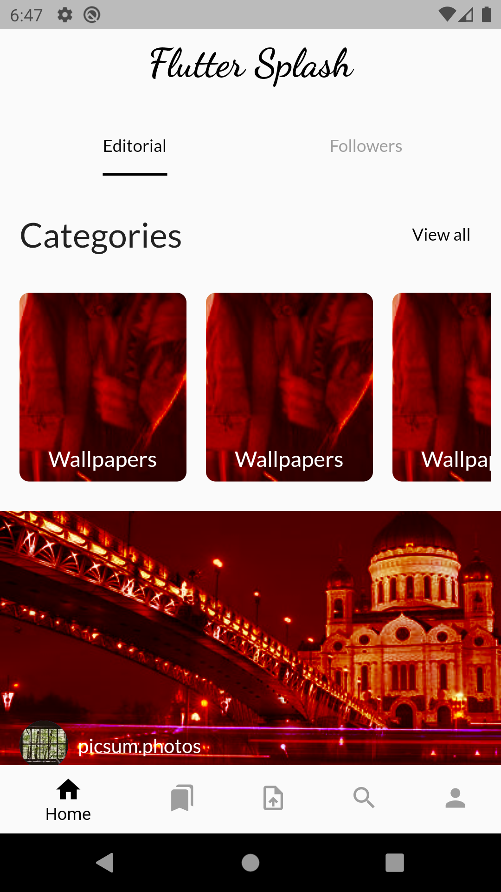
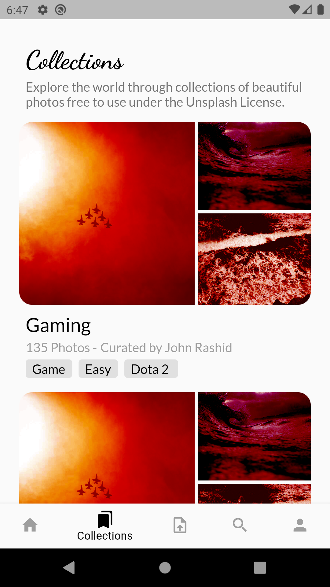
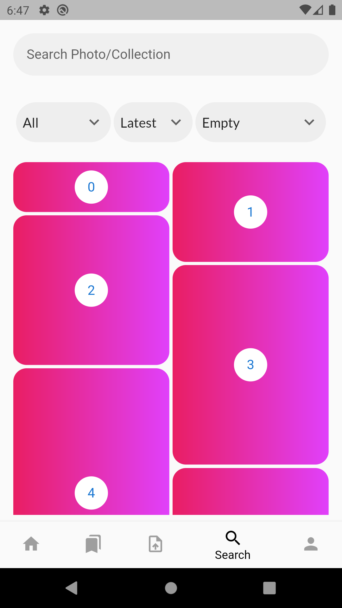

# flutter_splash

Redesign [Unsplash](https://unsplash.com/) Mobile Application with flutter tools.

# About

its open source application based [Unsplash API](https://unsplash.com/documentation)  for training Flutter , Dio , Cubit(Bloc) state management tool.

# View

Under development.

  
   
  
    

### References

https://dribbble.com/shots/7355727-Unsplash-App-Design-Concept

https://dribbble.com/shots/9975847-Unsplash-Redesign-App-Concept

https://dribbble.com/shots/5093772-Unsplash-Redesign

https://dribbble.com/shots/3712023-Unsplash-App-Icon

